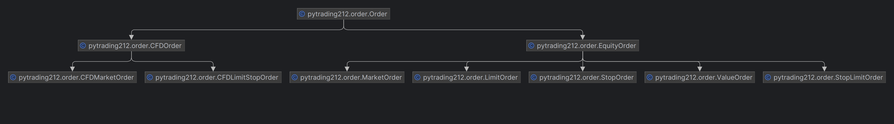

<div align="center">

# PyTrading212 API

## Unofficial API for Trading212
### Unofficial API for Trading212 broker.


### [Documentation](https://hellambro.github.io/Trading212API/)

### Support the Project

#### With a :star:

[](https://star-history.com/#HellAmbro/Trading212API&Date)

#### With a donation

<a href="https://www.buymeacoffee.com/hellambro" target="_blank"></a>

**LTC** LbAzhtHBvQ2JCGhrcefUuvwNrv9VrQJoyJ

**BTC** 1JWhMC3tiSjyR6t7BJuM7YRDg3xvPM2MDk

**ETH** 0x51f1f0061eadc024ab4bd1f3658d249044160006

</div>

<div align="left">

### Discord Channel for support
[Discord](https://discord.gg/PmWemEUA)

  ## Installation

```bash
pip install pytrading212
```

### Warning :warning:

When you are using the API you cannot access Trading212 from other devices and browsers, except for the webdriver.New
access from another browser may disconnect the current session, invalidating the _cookie_ and making the API not work.

## PyTrading212 Usage

For a full reference please look inside **examples** folder

### Equity Example

```python
from selenium import webdriver
from selenium.webdriver.chrome.service import Service

from pytrading212 import Equity
from pytrading212 import Mode, EquityOrder, OrderType

driver = webdriver.Chrome(service=Service())
equity = Equity(email='your_email', password='your_password', driver=driver, mode=Mode.DEMO)

# Invalid order: voluntary typo-error in instrument code
order = EquityOrder(instrument_code="AAAAPL_US_EQ", order_type=OrderType.MARKET, quantity=2)
is_valid, reason = equity.check_order(order)
if is_valid:
    print("Your order is valid, can be executed.")
else:
    print("Your order is not valid. The reason is: ", reason)
# Valid order
order = EquityOrder(instrument_code="AAPL_US_EQ", order_type=OrderType.MARKET, quantity=2)

# Check order validity (recommended)
if equity.check_order(order)[0]:
    # Review order (recommended)
    print(equity.review_order(order))
    # Execute order
    print(equity.execute_order(order))

equity.finish()
```

### CFD Example

```python
from selenium import webdriver
from selenium.webdriver.chrome.service import Service

from pytrading212 import CFD, CFDOrder
from pytrading212 import Mode

driver = webdriver.Chrome(service=Service())
cfd = CFD(email='your_email', password='your_password', driver=driver, mode=Mode.DEMO)

instrument_code = "AAPL"

cfd_order = CFDOrder(instrument_code=instrument_code,
                     quantity=-0.1,  # Sell (quantity is negative)
                     target_price=cfd.get_current_price(instrument_code=instrument_code)
                     )

print(cfd.execute_order(order=cfd_order))
```

### PyTrading212 initialization

:warning: As now March 2023 only one instance at time is supported. :warning:

:x: This means that you cannot initialize both **Equity** and **CFD** :x:

PyTrading212 **Equity** instance

```python
driver = webdriver.Chrome(service=Service())
equity = Equity(email='your_email', password='your_password', driver=driver, mode=Mode.DEMO)
```

PyTrading212 **CFD** instance

```python
driver = webdriver.Chrome(service=Service())
cfd = CFD(email='your_email', password='your_password', driver=driver, mode=Mode.DEMO)
```

### PyTrading212 close session

Close the session, also the webdriver is closed.

```python
equity.finish()
```

or

```python
cfd.finish()
```

### Getting Instrument Code

```python
print(equity.get_companies())
```

or

```python
print(cfd.get_companies())
```

Returns a JSON with all Instrument code that you can trade, both CFD and Equity.

**Note**: Instrument code is different for _CFD_ and _Equity_ even for the same Stock.
For example **Apple** Instrument Code is:

```
CFD: AAPL
EQUITY: AAPL_US_EQ
```

### Order Structure



### [Equity Order](https://hellambro.github.io/Trading212API/order.html#pytrading212.order.EquityOrder)

It's possible to create **equity orders** directly from `EquityOrder` class

```python
# Buy
order = EquityOrder(instrument_code="AAPL_US_EQ", order_type=OrderType.MARKET, quantity=1)
equity.execute_order(order=order)
```

or

```python
# Buy
market_order = MarketOrder(instrument_code="AAPL_US_EQ", quantity=1)
equity.execute_order(order=market_order)
```

These two orders are equivalent, you can use both ways indifferently.

For selling stocks (**that you own**, for short-selling see CFD section below) you just need to change the sign of
_quantity_ or _value_ property

```python
# Sell
order = EquityOrder(instrument_code="AAPL_US_EQ", order_type=OrderType.MARKET, quantity=-1)
equity.execute_order(order=order)
```

or

```python
# Sell
market_order = MarketOrder(instrument_code="AAPL_US_EQ", quantity=-1)
equity.execute_order(order=market_order)
```

All other **equity order classes** are wrappers of the `EquityOrder`

#### Wrappers for Equity Orders

- MarketOrder

```python
market_order = MarketOrder(instrument_code="AAPL_US_EQ", quantity=1)
```

- LimitOrder

```python
limit_order = LimitOrder(instrument_code="AAPL_US_EQ",
                         quantity=2,
                         limit_price=150.0,
                         time_validity=constants.TimeValidity.DAY)
```

- StopOrder

```python
stop_order = StopOrder(instrument_code="AAPL_US_EQ",
                       quantity=-3,  # Sell
                       stop_price=180.0,
                       time_validity=constants.TimeValidity.GOOD_TILL_CANCEL)
```

- StopLimitOrder

```python
stop_limit_order = StopLimitOrder(instrument_code="AAPL_US_EQ",
                                  quantity=1,
                                  limit_price=150,
                                  stop_price=180,
                                  time_validity=constants.TimeValidity.DAY)
```

- ValueOrder

```python
value_order = ValueOrder(instrument_code="AAPL_US_EQ", value=2500.0)
```

These classes allow to simplify the creation of orders, avoiding errors for omitted parameters,
improving code readability.

### [CFD Order](https://hellambro.github.io/Trading212API/order.html#pytrading212.order.CFDOrder)

You can use 3 types of CFD Orders: `Market`, `Limit/Stop`, `OCO` (Order Cancel Order)

#### Market Order

- Market Order without Take Profit and Stop Loss

```python
instrument_code = "AAPL"
cfd_order = CFDMarketOrder(instrument_code=instrument_code,
                           quantity=0.1,  # Buy (quantity is positive)
                           target_price=cfd.get_current_price(instrument_code=instrument_code))
```

- MarketOrder with Take Profit (_limit_distance_)

```python
instrument_code = "AAPL"
current_price = cfd.get_current_price(instrument_code=instrument_code)
cfd_order = CFDMarketOrder(instrument_code=instrument_code,
                           quantity=0.5,
                           target_price=current_price,
                           limit_distance=5.0)
```

- MarketOrder with Stop Loss (_stop_distance_)

```python
instrument_code = "AAPL"
current_price = cfd.get_current_price(instrument_code=instrument_code)
cfd_order = CFDMarketOrder(instrument_code=instrument_code,
                           quantity=0.5,
                           target_price=current_price,
                           stop_distance=2.0)
```

- MarketOrder with Stop Loss and Take Profit

```python
instrument_code = "AAPL"
current_price = cfd.get_current_price(instrument_code=instrument_code)
cfd_order = CFDMarketOrder(instrument_code=instrument_code,
                           quantity=0.5,
                           target_price=current_price,
                           limit_distance=4.0,
                           stop_distance=2.0,
                           )
```

- CFD Stop Limit Order

#### Note about stop and limit distance

`stop_distance` and `limit_distance` are the _distance_ between the **current price** and SL/TP price.
You should add/subtract these quantities to the current price in order to get TP/SL price.

```                                                   
current_price = 150.0
limit_distance = 10.0   -> TP price = 150.0 + 10.0 = 160.0
stop_distance = 5.0     -> SL price = 150.0 - 5.0 =  145.0
```

#### Limit/Stop Order (Pending Order with specified price)

- Limit/Stop Order with Take Profit and Stop Loss

```python
instrument_code = "AAPL"
# Target price of Apple Stock, the current price - 20.0$ 
target_price = cfd.get_current_price(instrument_code=instrument_code) - 20.0
# Put a pending Buy Order when the price triggers target_price
cfd_order = CFDLimitStopOrder(instrument_code=instrument_code,
                              target_price=target_price,
                              quantity=1,
                              take_profit=target_price + 10,
                              # TP when Apple's stock price is  10.0$ above the target_price
                              stop_loss=target_price - 5)  # TP when Apple's stock price is  5.0$ below the target_price
```

- Limit/Stop Order without Take Profit

```python
instrument_code = "AAPL"
target_price = cfd.get_current_price(instrument_code=instrument_code) - 10.0
cfd_order = CFDLimitStopOrder(instrument_code=instrument_code,
                              target_price=target_price,
                              quantity=1,
                              stop_loss=target_price - 3.0)
```

- Limit/Stop Order without Stop Loss

```python
instrument_code = "AAPL"
target_price = cfd.get_current_price(instrument_code=instrument_code) - 30.0
cfd_order = CFDLimitStopOrder(instrument_code=instrument_code,
                              target_price=target_price,
                              quantity=1,
                              take_profit=target_price + 20)
```

- Limit/Stop Order without Take Profit and Stop Loss

```python
instrument_code = "AAPL"
target_price = cfd.get_current_price(instrument_code=instrument_code) + 30.0
cfd_order = CFDLimitStopOrder(instrument_code=instrument_code,
                              target_price=target_price,
                              quantity=-1) # Sell 
```

**Note about stop_loss and take_profit**

`stop_loss` and `take_profit` indicates the price of the stock when we want to make the TP or SL trades.

#### OCO Order (Order Cancel Order)

**Buy** 1 Apple's Stock when the price drops below 150.0$ (now ~162.0$): execute `order1`, cancel `order2`

or

**Sell** 1 Apple's Stock when the price rise above 180.0$ (now ~162.0$): execute `order2`, cancel `order1`
```python
instrument_code = "AAPL"
cfd_oco_order = CFDOCOOrder(instrument_code=instrument_code,
                            order1=CFDOCOOrder.OCOSubOrder(price=150, quantity=1),
                            order2=CFDOCOOrder.OCOSubOrder(price=180.0, quantity=-1))
```

### Useful resources

- [Use Trading212 for Automatic Trading: an introduction to pytrading212 (Depreacted since v0.2.5)](https://medium.com/@francescoelambroambrosini/use-trading212-for-automatic-trading-an-introduction-to-pytrading212-367449b40a6)
- [Driver requirements](https://www.selenium.dev/documentation/en/webdriver/driver_requirements)
- [Getting started with WebDriver](https://www.selenium.dev/documentation/en/getting_started_with_webdriver/)

### Disclaimer

Nor me or Trading212 are responsible for the use of this API, first make sure that everything works well through the use
of a **DEMO** account, then switch to **REAL** mode.

In addition, I don't take responsibility for the accuracy of the information reported here and the proper functioning of
the API

All trademarks, logos and brand names are the property of their respective owners. All company, product and service
names used in this website are for identification purposes only.

</div>
